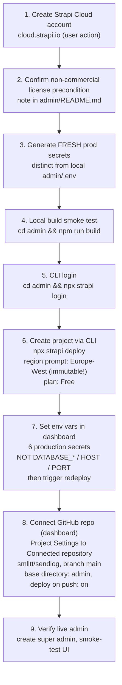

## Scope

Take the Strapi v5 admin app at [admin/](../../../admin/) from "scaffolded" to "live on Strapi Cloud Free" using the recommended platform from [context/foundation/infrastructure-admin.md](../../foundation/infrastructure-admin.md). The Astro / Cloudflare Worker app is **out of scope** — it is tracked separately by [deployment-plan.md](deployment-plan.md).

## Decisions (resolved up-front)

- **Repo layout: keep `admin/` as a subdirectory of the existing `smlltt/sendlog` repo.** Strapi Cloud's project-creation UI exposes a "Base directory" setting that makes monorepos first-class. Splitting into a separate `sendlog-admin` repo would buy nothing for a solo non-commercial MVP — it doubles the secrets surface, the CI/CD wiring, and the cognitive load. The admin code is already committed under `admin/` (`apps bootstrapped`); leaving it there is the minimum-friction path. The runner-up in [context/foundation/infrastructure-admin.md](../../foundation/infrastructure-admin.md) (self-hosted) is explicitly the fallback; we are taking the recommended path here.
- **Plan: Free.** Per infra doc, valid as long as SendLog stays non-commercial.
- **Region: Europe-West.** Immutable at project creation — getting this right is the single most consequential dashboard click.
- **Deploy mechanism: CLI-first project creation, then connect the GitHub repo post-creation for auto-build.** Strapi Cloud's web wizard ([docs.strapi.io/cloud/getting-started/deployment](https://docs.strapi.io/cloud/getting-started/deployment)) has three steps (plan → connect repo → configure), and the "Base directory" field needed for monorepos only appears in step 3. But step 2 hard-scans the **repo root's** `package.json` for `@strapi/strapi` and aborts before step 3 is reached — exactly the "Strapi was not found in the project dependencies" block hit on a first attempt. The CLI flow ([docs.strapi.io/cloud/getting-started/deployment-cli](https://docs.strapi.io/cloud/getting-started/deployment-cli)) bypasses this scan: `npx strapi deploy` from inside `admin/` creates the Strapi Cloud project directly from local files (region + plan prompted in terminal). Only after the project exists do we connect `smlltt/sendlog` via Project Settings → Connected repository, set Base directory `admin`, and toggle "Deploy on push" — at which point both `git push origin main` and `npx strapi deploy` re-trigger builds.

## Current repo state (verified)

- [admin/package.json](../../../admin/package.json) — Strapi `5.46.1`, `@strapi/plugin-cloud` `5.46.1` already installed, `strapi.uuid` set, Node engine `>=20.0.0 <=24.x.x`.
- [admin/config/database.ts](../../../admin/config/database.ts) — already supports Postgres via `DATABASE_URL`; locally falls through to SQLite at `.tmp/data.db`. No change needed for Strapi Cloud (its managed Postgres + `DATABASE_URL` is auto-injected at build time).
- [admin/config/server.ts](../../../admin/config/server.ts) / [admin/config/admin.ts](../../../admin/config/admin.ts) — env-driven, ready.
- [admin/.env.example](../../../admin/.env.example) — tracked. `admin/.env` is correctly gitignored (verified via `git check-ignore`).
- Git remote: `https://github.com/smlltt/sendlog.git`, branch `main`.

## Inputs already confirmed

- **Repo / branch / base directory**: `smlltt/sendlog`, `main`, `admin`.
- **Plan**: Strapi Cloud Free.
- **Region**: Europe-West (immutable; chosen at project creation).
- **Strapi version**: `5.46.1` pinned in [admin/package.json](../../../admin/package.json); `@strapi/plugin-cloud` already present.
- **Node version**: 22 — matches [.nvmrc](../../../.nvmrc) (`22.14.0`) and the `engines` constraint in [admin/package.json](../../../admin/package.json) (`>=20.0.0 <=24.x.x`).
- **License precondition**: SendLog is a non-commercial MVP — Strapi Cloud Free license is valid.
- **CI/CD wiring**: project created via CLI; GitHub repo connected to the existing Strapi Cloud project post-creation (Project Settings → Connected repository). No `.github/workflows/*.yml` change required for this round.
- **Strapi Cloud account**: **created**, signed in via GitHub; Strapi Cloud GitHub App authorized on `smlltt/sendlog`. The wizard's repo-pick step blocked on "Strapi was not found in the project dependencies" — this is the monorepo edge case the CLI flow circumvents.

## Prerequisites

These are the one-time setup steps that must be true before Step 1 ("Strapi Cloud account") can land. Skip any sub-section already satisfied. The "Inputs already confirmed" block above reflects the **current** operator's state; a future operator picking this plan up cold should walk through every sub-section.

### A. Strapi Cloud account & GitHub App

1. **Create a Strapi Cloud account** at https://cloud.strapi.io. The fastest path is **Sign in with GitHub** using the same GitHub identity that owns `smlltt/sendlog` — it pre-authorizes the Cloud → GitHub link and skips a manual app install later.
2. **Confirm Free plan availability** on your account. The Free plan is non-time-limited but **non-commercial** ([context/foundation/infrastructure-admin.md](../../foundation/infrastructure-admin.md) §"Devil's Advocate" #1). If your Strapi account is already attached to a paid org, Free may not appear as an option there — create / use a personal account instead.
3. **Authorize the Strapi Cloud GitHub App** on `smlltt/sendlog`. During Step 5 (project creation), Strapi Cloud will redirect to GitHub's app-install screen. Grant access to either:
   - **All repositories** (simpler, broader access), or
   - **Only select repositories** → check `smlltt/sendlog` (more conservative; required if you later want to limit access).
   The app needs read access to repo contents + commit statuses, and write access to deployments (Strapi Cloud manages this in the consent screen).
4. **Region awareness**: Strapi Cloud's region selector at project creation is **immutable**. Decision is locked to **Europe-West** (per infra doc §"Risk Register"). Do not click through until you have visually confirmed Europe-West is selected.
5. **Optional — switching accounts later**: there is no "switch account" UI; sign out and back in with a different GitHub identity. The Strapi Cloud GitHub App installation lives on the GitHub side and can be uninstalled from `github.com/settings/installations`.

### B. GitHub repository state

The Strapi Cloud GitHub-connected build clones the repo at the configured branch on each push. Two things must be true before Step 5:

1. **`smlltt/sendlog` is reachable** from your authenticated `gh` / GitHub account (verified — the repo is the active `origin` per `git remote -v`).
2. **`admin/` exists on `main` at HEAD** and contains a complete Strapi project (verified — `apps bootstrapped` commit includes it). No subtree split, no `.gitmodules` quirks.
3. **Branch protection** is not required for first deploy. If you add it later, ensure the Strapi Cloud GitHub App has the "Bypass" permission OR run deploys from a protected pattern that allows the Strapi App's commits (relevant only if Strapi Cloud later writes commits back; the Free plan does not).
4. **`admin/.env` stays gitignored** — verified via `git check-ignore`. Production secrets must never reach the repo; they live in the Strapi Cloud dashboard only (Step 6).

### C. Local tooling

Strapi Cloud builds in its own container, so the local toolchain is only needed for Steps 3, 4, and any later manual `strapi deploy`.

1. **Node 22** — match [.nvmrc](../../../.nvmrc). With nvm: `nvm install && nvm use`. Strapi v5 errors with a soft engine warning on mismatched majors; Strapi Cloud's container uses Node 22 regardless of your local version.
2. **No global Strapi install needed** — `@strapi/strapi` and `@strapi/plugin-cloud` are already in [admin/package.json](../../../admin/package.json) at `5.46.1`. Invoke via `npm run` scripts (`build`, `deploy`, `develop`). Do not `npm install -g @strapi/strapi`.
3. **`openssl`** — used in Step 3 to generate production secrets. Pre-installed on macOS; on Linux it ships with most distros. If absent, any cryptographically-secure RNG of equivalent entropy works (`node -e "console.log(require('crypto').randomBytes(16).toString('base64'))"` is a drop-in).
4. **A password manager** for the six production secrets generated in Step 3 — they are pasted into the Strapi Cloud dashboard in Step 6 and must not be committed, emailed, or pasted into chat. Losing them after Step 6 means rotating each via the dashboard + redeploying.
5. **Strapi CLI login is required** (this flow uses CLI for project creation, not just optional re-triggers): `cd admin && npx strapi login` opens a browser OAuth flow against your Strapi Cloud account. Authenticated state is cached locally under `~/.config/strapi-cloud/` (or platform equivalent); `npx strapi logout` revokes.

### D. Production database & runtime (informational — no user action)

Strapi Cloud Free auto-provisions and manages everything below; the table is included so an operator does **not** spend time setting them manually in Step 6.

1. **Postgres** — managed; `DATABASE_URL`, `DATABASE_CLIENT`, and every `DATABASE_*` value is injected at build/runtime. [admin/config/database.ts](../../../admin/config/database.ts) already routes on `DATABASE_CLIENT`, so prod automatically uses the Postgres branch.
2. **Object storage / media** — managed; no R2/S3 to provision. Backups beyond Strapi Cloud's own infra are out of scope (infra doc Risk Register row "Media library has no managed backup").
3. **Direct DB access** — restricted on current Strapi Cloud GA infra; schema-level debugging is unavailable until the 2026 infra migration ships (infra doc §"Devil's Advocate" #8). Plan operations around the admin UI and Content API.
4. **HOST / PORT** — injected by Strapi Cloud's container; do not override.

### E. What goes where — env var matrix

| Value | Local dev ([admin/.env](../../../admin/.env)) | Production (Strapi Cloud dashboard → Variables) |
| --- | --- | --- |
| `APP_KEYS` | locally-generated, present | **fresh prod value from Step 3** |
| `API_TOKEN_SALT` | locally-generated, present | **fresh prod value from Step 3** |
| `ADMIN_JWT_SECRET` | locally-generated, present | **fresh prod value from Step 3** |
| `TRANSFER_TOKEN_SALT` | locally-generated, present | **fresh prod value from Step 3** |
| `JWT_SECRET` | locally-generated, present | **fresh prod value from Step 3** |
| `ENCRYPTION_KEY` | locally-generated, present | **fresh prod value from Step 3** |
| `DATABASE_CLIENT` | `sqlite` (default) | **auto-injected** (`postgres`) — do not set |
| `DATABASE_URL` | unused (sqlite uses `DATABASE_FILENAME`) | **auto-injected** — do not set |
| `DATABASE_FILENAME` | `.tmp/data.db` | n/a |
| `HOST` / `PORT` | `0.0.0.0` / `1337` | **auto-injected** — do not set |

Neither column ever lands in source control. `admin/.env` is gitignored; production values live only in Strapi Cloud's dashboard. The starter's [admin/.env.example](../../../admin/.env.example) is the only env-shaped file that is tracked.

## Deploy flow



## Step 1 — Strapi Cloud account (user action)

Sign up at https://cloud.strapi.io (GitHub OAuth is the smoothest path since the repo lives on GitHub). When prompted to install/authorize the **Strapi Cloud GitHub App**, grant it access at least to `smlltt/sendlog`.

## Step 2 — Lock in the non-commercial license precondition

Add a one-line precondition note to [admin/README.md](../../../admin/README.md) (top of file, before the Strapi-generated content). Example:

```markdown
> SendLog is a non-commercial MVP; this admin app runs on the Strapi Cloud Free plan, whose license forbids commercial use. See [context/foundation/infrastructure-admin.md](../context/foundation/infrastructure-admin.md) and the project PRD before introducing any monetization.
```

Rationale: the infra doc's top Risk Register row ("becomes commercial and violates Free non-commercial license") is the single highest-impact license risk. Recording the precondition at the admin's `README.md` keeps it visible.

## Step 3 — Generate fresh production secrets

`admin/.env` already exists with locally-generated secrets, but it should be treated as dev-only. Generate a fresh set for production and keep them in a password manager until step 6 pastes them into the Strapi Cloud dashboard.

```bash
for v in APP_KEYS API_TOKEN_SALT ADMIN_JWT_SECRET TRANSFER_TOKEN_SALT JWT_SECRET ENCRYPTION_KEY; do
  if [ "$v" = "APP_KEYS" ]; then
    echo "$v=$(for i in 1 2 3 4; do openssl rand -base64 16 | tr -d '\n'; [ $i -lt 4 ] && echo -n ','; done)"
  else
    echo "$v=$(openssl rand -base64 16)"
  fi
done
```

Do **not** write these to any file in the repo. Do not reuse the values in `admin/.env`. Local `admin/.env` stays untouched and gitignored.

## Step 4 — Local build smoke test

Confirm `admin/` still builds cleanly before involving Strapi Cloud:

```bash
cd admin
npm run build
```

Acceptance: exit code 0; `admin/dist/` populated; no Strapi v5 schema errors. If it fails, stop — Strapi Cloud will fail the same way.

## Step 5 — CLI login

```bash
cd admin
npx strapi login
```

Opens a browser OAuth flow against `cloud.strapi.io` and binds the local session to your account. The Strapi Cloud account must already exist (Prerequisites §A.1). On success the terminal prints a confirmation; auth state is cached on disk (`~/.config/strapi-cloud/` or platform equivalent) and persists until `npx strapi logout`.

Acceptance: command exits 0; `npx strapi me` (or equivalent identity check, if available) shows your account.

## Step 6 — Create the Strapi Cloud project via CLI

```bash
cd admin
npx strapi deploy
```

`strapi deploy` from a fresh project (no `.strapi-cloud.json` yet) is the documented bootstrap path ([docs.strapi.io/cloud/getting-started/deployment-cli](https://docs.strapi.io/cloud/getting-started/deployment-cli)). It will interactively prompt for:

- **Project display name** — suggest `sendlog-admin`.
- **Plan** — **Free**.
- **Region** — **Europe-West** (**immutable** after this prompt — verify the selection before pressing Enter; the infra doc's Risk Register row "Wrong region selected" applies here).

The CLI then tarballs `admin/` (respecting `.gitignore` / `.strapi-cloud-ignore`), uploads it, and triggers the first build. The terminal streams a progress bar until the project URL is printed: `https://<slug>.strapiapp.com/`.

A `.strapi-cloud.json` file is written to `admin/` linking the local project to the cloud one. It is already gitignored by the Strapi v5 default `admin/.gitignore` (line 131). Keep it that way for solo workflow; if a second operator joins, share via secure channel (not the repo).

**Expected outcome of the first build:** the build will likely **fail** at the runtime-startup stage because the six production secrets are not yet set on Strapi Cloud's side (CLI deploy does **not** upload local `.env` by default in v5+; even if it did, our local `admin/.env` holds dev-only values per Step 3). This is expected — Step 7 fixes it. A "missing APP_KEYS" or "ADMIN_JWT_SECRET is required" failure in the dashboard build log is the canonical signal.

If the build instead fails on Node/deps resolution: re-check the `engines` field in [admin/package.json](../../../admin/package.json) and the Node version Strapi Cloud auto-selected (visible in the build log header).

## Step 7 — Configure environment variables in dashboard

Open the new project in the Strapi Cloud dashboard, then **Settings → Variables**. Add the six fresh secrets generated in Step 3:

- `APP_KEYS`
- `API_TOKEN_SALT`
- `ADMIN_JWT_SECRET`
- `TRANSFER_TOKEN_SALT`
- `JWT_SECRET`
- `ENCRYPTION_KEY`

Do **not** set `HOST`, `PORT`, `DATABASE_CLIENT`, `DATABASE_URL`, or any other `DATABASE_*` value — Strapi Cloud auto-injects these for the managed Postgres + container. Setting them manually causes hard-to-debug overrides.

Save, then trigger a redeploy from the dashboard (**Deploys → Trigger deploy**, or re-run `npx strapi deploy` from the terminal). Watch the build log to green:

1. Pull project source (already uploaded in Step 6)
2. `npm ci`
3. `npm run build` (`strapi build`)
4. Provision/connect managed Postgres (idempotent after first build)
5. Start container
6. Live at `https://<slug>.strapiapp.com/`

Acceptance: build log green; project URL serves an HTTP 200; `/admin/` returns the bootstrap super-admin signup screen.

## Step 8 — Connect GitHub repo for auto-deploy on push

With the project healthy, wire up the GitHub repo so future `git push origin main` events trigger builds (and `npx strapi deploy` becomes optional re-trigger only).

In Strapi Cloud dashboard → **Project Settings → General → Connected repository**, click **Connect repository** (or **Update repository** if a placeholder is shown):

- **Provider**: GitHub
- **Repository**: `smlltt/sendlog`
- **Branch**: `main`
- **Base directory**: `admin` — **this** is the field that was blocked in the wizard's pre-creation flow; here it is editable because the project already exists. Confirm `admin` is typed exactly (no leading `/` or trailing `/`).
- **Auto-deploy on push**: enabled

Save. Push a trivial commit to `main` (or run `npx strapi deploy` once more) to validate that the GitHub-triggered build succeeds with the same env vars from Step 7. The dashboard's Deploys log should now show the build origin as GitHub, not CLI.

If the dashboard shows "Base directory was not found in your repo" after save: toggle Auto-deploy off then on and save again ([Strapi support article 9518805612](https://support.strapi.io/articles/9518805612-why-am-i-seeing-base-directory-was-not-found-in-your-repo-error-in-strapi-cloud)).

## Step 9 — Verify live

1. Open `https://<slug>.strapiapp.com/admin/`
2. Create the first super admin account (one-time, irreversible without a fresh deploy).
3. Confirm the admin UI loads, the Content-Type Builder is usable, and `Settings → Roles` is reachable.

Note: do **not** create the API token for the Astro Worker yet — that's a follow-up step covered by [context/foundation/infrastructure-admin.md](../../foundation/infrastructure-admin.md) Getting Started step 4, and is out of scope for this round.

## Explicitly out of scope (this round)

- Astro Worker wiring (`STRAPI_API_TOKEN` Worker secret, edge-cache layer, REST/GraphQL fetches) — separate task, infra-admin.md Getting Started steps 4–5.
- Content type modeling (regions / crags / routes / topos) — separate task.
- Backup script for media library (infra-admin.md Risk Register).
- Splitting `admin/` into its own repo — kept as a future option if monorepo friction emerges.
- Custom domain / DNS for Strapi Cloud.
- Self-hosting fallback ([context/foundation/infrastructure-admin.md](../../foundation/infrastructure-admin.md) §2).

## Risks called out by the infra doc this plan actively mitigates

- **"Wrong region selected at project creation (immutable)"** — step 6 elevates the region prompt in the CLI flow and warns about immutability before the user presses Enter.
- **"Free non-commercial license violation"** — step 2 records the license precondition in [admin/README.md](../../../admin/README.md).
- **"CLI is deploy-only; agents cannot complete the full ops loop"** — we use CLI for project creation specifically (where it bypasses the wizard's monorepo scan), then hand ongoing ops to the dashboard (env vars, GitHub auto-deploy, redeploys, logs, rollback) where Strapi Cloud's strongest tooling lives.
- **"Secret update race during deploy"** (parallel to infra.md Worker plan) — step 7 sets env vars after CLI bootstraps the project; the first CLI-triggered build is expected to fail at runtime startup until vars are set, then the explicit redeploy step takes them.
- **Monorepo wizard block** (encountered live) — step 6's CLI-first path is the documented Strapi-supported workaround; step 8 then attaches the GitHub repo with Base directory `admin` after the project exists.

## Rollback / abort handling

- Pre-step 6: nothing to roll back on Strapi Cloud's side — only local files touched. `git checkout -- admin/README.md` if step 2 was rejected; `rm admin/.strapi-cloud.json` if a half-finished CLI deploy needs to be reset.
- Post-step 6, no super-admin yet: delete the Strapi Cloud project from the dashboard and recreate via CLI. No data loss because no admin user / content exists yet. Remove `admin/.strapi-cloud.json` locally before re-running `npx strapi deploy` so the CLI bootstraps a new project rather than re-targeting the deleted one.
- Post-step 9 (super-admin created): use **Deploys → Redeploy previous version** in the Strapi Cloud dashboard; CLI rollback is not available in current GA per the infra doc.

## Execution log (so far)

- 2026-05-25 — Strapi Cloud account created and signed in via GitHub; Strapi Cloud GitHub App authorized on `smlltt/sendlog`.
- 2026-05-25 — Web wizard's repo-pick step (Step 2 of the 3-step wizard) blocked on "Strapi was not found in the project dependencies" because `@strapi/strapi` lives only in [admin/package.json](../../../admin/package.json), not at the repo root. Switched the plan from "GitHub-connected wizard" to "CLI-first deploy then connect repo post-creation"; this section reflects the updated flow.
- 2026-05-25 — Added the Strapi Cloud Free non-commercial precondition note to [admin/README.md](../../../admin/README.md).
- 2026-05-25 — Generated a fresh production secret set and copied it to the operator clipboard; the earlier chat-exposed set was discarded.
- 2026-05-25 — Ran `STRAPI_TELEMETRY_DISABLED=true npm run build` from [admin/](../../../admin/); Strapi v5 build completed successfully.
- 2026-05-25 — Confirmed Strapi Cloud CLI login via `npx strapi login`.
- 2026-05-25 — Created Strapi Cloud project `sendlog-admin` via `npx strapi deploy` with Node `22` and region `Europe (West)` (`AMS`). Internal project name: `sendlog-admin-0a0e02aa14`; dashboard: https://cloud.strapi.io/projects/sendlog-admin-0a0e02aa14. Initial Cloud build completed successfully.
- 2026-05-25 — Rotated Strapi Cloud default secret variables with the dashboard generator, added `ENCRYPTION_KEY`, and confirmed production has a live deployment with no pending deployment.
- 2026-05-25 — Connected GitHub repository `smlltt/sendlog` on branch `main` with base directory `admin` and auto-deploy enabled. The connection triggered a production deploy, which completed with `hasLiveDeployment: true` and `hasPendingDeployment: false`.
- 2026-05-25 — Confirmed live admin at https://light-talent-409ec7d381.strapiapp.com/admin/ — HTTP 200 from the production environment.
- 2026-05-25 — Super admin bootstrapped via the live admin UI. Smoke test results: `Settings → Roles` reachable; Content-Type Builder loads but shows the expected "Strapi is in production mode, editing content types is disabled" toast (Strapi Cloud runs `strapi start`, so schema edits must be done locally via `npm run develop` and committed; auto-deploy rebuilds Strapi Cloud with the new schema). Plan complete.
