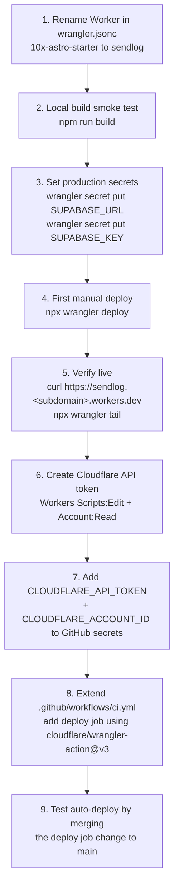

## Scope

Take the Astro app at the repo root from "scaffolded" to "live on Cloudflare Workers" using the exact path from `Getting Started` in [context/foundation/infrastructure.md](../../foundation/infrastructure.md), then add an auto-deploy-on-merge GitHub Actions job. The `admin/` Strapi sidecar is **out of scope** — it will be handled in a separate infra round.

## Inputs already confirmed

- Worker name: `sendlog`
- Cloudflare account: `samuel.liotta@gmail.com` (account ID `ee90be62a9b76750f8d5743ace4bbd64`), already authenticated locally — `npx wrangler whoami` succeeded
- Supabase secrets: user has them on hand and will paste when `wrangler secret put` prompts
- CI/CD: add an auto-deploy job to [.github/workflows/ci.yml](../../../.github/workflows/ci.yml)

## Prerequisites

These are the one-time setup steps that must be true before Step 1. Skip any sub-section that's already satisfied for you (the "Inputs already confirmed" block above marks both as satisfied for the current operator, but a future operator picking this plan up cold should walk through them).

### A. Cloudflare CLI (`wrangler`) configuration

1. **Cloudflare account** — sign up at https://dash.cloudflare.com if you don't have one. The free Workers plan is sufficient for the MVP (10M requests/month, 3 MB Worker bundle limit — see Risk Register in [context/foundation/infrastructure.md](../../foundation/infrastructure.md)).
2. **Node 22** — match [.nvmrc](../../../.nvmrc) (`22.14.0`). If using nvm: `nvm install && nvm use`. Mismatched Node versions can produce confusing `wrangler` errors and ESLint engine warnings.
3. **No global install needed** — `wrangler` is already a devDependency in [package.json](../../../package.json) (`wrangler: ^4.90.0`). Invoke it via `npx wrangler`. Do **not** `npm install -g wrangler`; the pinned local version is the source of truth.
4. **Authenticate** — run `npx wrangler login`. This opens a browser OAuth flow against your Cloudflare account. It writes credentials to `~/Library/Preferences/.wrangler/config/default.toml` on macOS (`~/.config/.wrangler/...` on Linux). The flow grants an OAuth token with these scopes:
   - `account` (read)
   - `user` (read)
   - `workers` (write)
   - `workers_kv` (write)
   - `workers_routes` (write)
   - `workers_scripts` (write)
5. **Verify** — `npx wrangler whoami`. Expected output: your email, your Account Name, and the 32-char Account ID. Capture the Account ID; it will be needed again in Step 7 as the `CLOUDFLARE_ACCOUNT_ID` GitHub secret.
6. **Known cosmetic issue (macOS)** — `wrangler` may print `EPERM: operation not permitted, open '/Users/.../Library/Preferences/.wrangler/logs/...'` before its real output. The command still succeeds with exit code 0; the log-write failure is cosmetic and can be ignored for this deploy. If you want to silence it, `mkdir -p ~/Library/Preferences/.wrangler/logs` once.
7. **Optional: switch accounts later** — `npx wrangler logout` then `npx wrangler login` again. There's no "switch" sub-command; `wrangler` uses one account at a time per machine.

### B. Supabase configuration

Production Supabase is a hosted dependency, not a Cloudflare binding — the Worker reaches it over HTTPS from `[src/lib/supabase.ts](../../../src/lib/supabase.ts)` using `@supabase/ssr`'s `createServerClient`. Two values must exist before Step 3 can set production secrets:

1. **Create a Supabase project** at https://supabase.com/dashboard → New project.
   - **Region**: pick an EU region (`eu-central-1` / `eu-west-1`). The infra doc's risk register row "External Supabase or Strapi latency dominates request time" specifically recommends EU placement because Cloudflare Workers route to the nearest data centre and the user base is EU-anchored.
   - **Database password**: generate and store in your password manager. It is *not* used by the Astro app at runtime, but you will need it for `npx supabase` CLI operations later.
   - **Project name** suggestion: `sendlog` (or `sendlog-prod` if you also plan a staging project — out of scope for this round).
2. **Grab the API credentials** — Project Settings → API:
   - `SUPABASE_URL` = the "Project URL" field, shape `https://<ref>.supabase.co`.
   - `SUPABASE_KEY` = the **publishable / anon key** (the long JWT under "Project API keys" labelled `anon` / `public`, or the new `sb_publishable_...` key if your project has been migrated to the new key format). **Never** use the `service_role` key here — it bypasses RLS and would be a critical leak when shipped to a Worker. The app's SSR client at [src/lib/supabase.ts](../../../src/lib/supabase.ts) is designed for the anon key + cookie-based session.
3. **Email/password auth is the live flow** — checked via [src/pages/api/auth/signin.ts](../../../src/pages/api/auth/signin.ts) which calls `signInWithPassword`. Supabase enables email/password by default. Two follow-ups in the Supabase Dashboard:
   - Authentication → Providers → Email → enable **"Confirm email"** (the starter ships a [src/pages/auth/confirm-email.astro](../../../src/pages/auth/confirm-email.astro) page that expects this flow).
   - Authentication → URL Configuration → set **Site URL** and the **Redirect URLs** allow-list. For the first deploy you don't yet know the workers.dev URL — that's fine; **circle back and add `https://sendlog.<your-subdomain>.workers.dev` and `https://sendlog.<your-subdomain>.workers.dev/auth/callback` immediately after Step 4** (see the addendum at the end of Step 5). Without this, magic-link / email-confirmation redirects will fail in production.
4. **RLS posture** — per [AGENTS.md](../../../AGENTS.md): "New Supabase tables: enable RLS with granular per-operation, per-role policies." The first deploy has no application tables yet (migrations under `supabase/migrations/` are empty), so RLS work is deferred until features land. Just keep the rule in mind before adding any table.
5. **Optional: local Supabase** — `npx supabase start` (requires Docker) spins up the full local stack using the bundled [supabase/config.toml](../../../supabase/config.toml). Local dev uses its own anon key (printed by `supabase status`), pasted into `.dev.vars` — separate from the production secrets being set in Step 3. The local `project_id` in `config.toml` is still the starter default `10x-astro-starter`; renaming it to `sendlog` is cosmetic and **not required** for this deploy.
6. **What goes where**:

   | Value | Local dev | Production (Cloudflare Worker) |
   | --- | --- | --- |
   | `SUPABASE_URL` | `.dev.vars` (from `npx supabase status`, typically `http://127.0.0.1:54321`) | `wrangler secret put SUPABASE_URL` (production project URL) |
   | `SUPABASE_KEY` | `.dev.vars` (local anon key from `npx supabase status`) | `wrangler secret put SUPABASE_KEY` (production anon / publishable key) |

   Neither value should ever land in `.env.example`, source control, or a CI environment beyond the build step. [.gitignore](../../../.gitignore) already excludes `.dev.vars` and `.env*` — verify before committing if in doubt.

## Repo state to be aware of

- [wrangler.jsonc](../../../wrangler.jsonc) still has the starter default `"name": "10x-astro-starter"` and is already in the uncommitted set — it must be renamed before any deploy.
- [astro.config.mjs](../../../astro.config.mjs) declares both Supabase env vars as `context: "server", access: "secret", optional: true`, so the build will succeed even before secrets are set; only runtime auth would fail without them.
- [.github/workflows/ci.yml](../../../.github/workflows/ci.yml) currently builds but does not deploy.
- Other uncommitted files (`.cursor/.10x-cli-manifest.json`, `.cursor/rules/10x-course.mdc`, `context/foundation/infrastructure*.md`, `.cursor/skills/10x-infra-research/`) are unrelated to deploy mechanics; we will not touch them here.

## Deploy flow



## Step 1 — Rename the Worker

Edit [wrangler.jsonc](../../../wrangler.jsonc):

```jsonc
{
  "$schema": "node_modules/wrangler/config-schema.json",
  "name": "sendlog",
  "main": "@astrojs/cloudflare/entrypoints/server",
  // ...rest unchanged
}
```

Rationale: the infra doc's Getting Started step 2 explicitly calls out renaming from the starter value before first deploy. The Worker name appears in the default URL `sendlog.<account-subdomain>.workers.dev` and renaming it later requires migrating traffic.

## Step 2 — Local build smoke test

```bash
npm run build
```

Acceptance: build succeeds and produces `dist/` containing both the static assets (consumed by the `ASSETS` binding) and `_worker.js` (the SSR entrypoint). No code changes expected; this is purely to confirm the renamed config still builds before we touch production. If it fails, stop and triage before pushing secrets.

## Step 3 — Set production secrets BEFORE deploying

Per the infra doc's Unknown Unknowns ("`wrangler secret put` immediately after deploy can race; update secrets before deploy") and Risk Register row "Secret update race during deploy":

```bash
npx wrangler secret put SUPABASE_URL
npx wrangler secret put SUPABASE_KEY
```

Each command prompts for the value. The user will paste them at the prompt — they are never written to disk. After both, confirm with:

```bash
npx wrangler secret list
```

Acceptance: both secrets show up with non-empty `created_on`.

Note on the chicken-and-egg: `wrangler secret put` requires the Worker to exist in Cloudflare's API. If this is truly the first deploy, the recommended idiom is `wrangler deploy --dispatch-namespace` style, but for a standard Worker the simpler path is:

- Run `npx wrangler secret put SUPABASE_URL`; if Cloudflare returns "Worker not found", proceed to Step 4 first (deploy without secrets — Astro env schema marks them `optional: true`), then come back and set secrets, then redeploy with `npx wrangler deploy` to make the secrets take effect.

I will resolve this branch live based on what `wrangler secret put` actually responds with on the first invocation.

## Step 4 — First manual deploy

```bash
npx wrangler deploy
```

Acceptance:
- Exit code 0
- Wrangler prints a published URL of the form `https://sendlog.<subdomain>.workers.dev`
- The same URL appears in `npx wrangler deployments list`

## Step 5 — Verify

Open the published URL in a browser AND probe from the terminal:

```bash
curl -I https://sendlog.<subdomain>.workers.dev/
npx wrangler tail
```

Acceptance:
- `/` returns HTTP 200 with HTML
- `wrangler tail` shows the request log entry with no runtime errors
- Open a Supabase-auth route (per [AGENTS.md](../../../AGENTS.md), `src/middleware.ts` gates `PROTECTED_ROUTES`) and confirm the redirect-to-signin happens server-side without 500s

If a Workerd-incompatibility error appears (Risk Register row "Workerd incompatibility from a dependency"), stop and triage — do **not** continue to CI wiring until a green manual deploy is achieved.

### Step 5 addendum — Add the live URL to Supabase

Now that the workers.dev URL is known, go back to Supabase Dashboard → Authentication → URL Configuration and add:

- **Site URL**: `https://sendlog.<your-subdomain>.workers.dev`
- **Redirect URLs** (allow-list): `https://sendlog.<your-subdomain>.workers.dev/**`

Save. Without this, signup confirmation emails and password-reset links will redirect to `http://localhost:3000` (the Supabase default) and break for end users hitting production.

## Step 6 — Cloudflare API token for CI

User action (cannot be automated): create a token at https://dash.cloudflare.com/profile/api-tokens using the "Edit Cloudflare Workers" template, OR with custom permissions:

- Account → Workers Scripts → Edit
- Account → Account Settings → Read
- User → User Details → Read
- Zone → Workers Routes → Edit (only if custom domain is added later — safe to include now)

Account resources: include the `samuel.liotta@gmail.com` account.

## Step 7 — Add GitHub Actions repo secrets

User action in GitHub repo settings (`smlltt/sendlog` → Settings → Secrets and variables → Actions):

- `CLOUDFLARE_API_TOKEN` = token from Step 6
- `CLOUDFLARE_ACCOUNT_ID` = `ee90be62a9b76750f8d5743ace4bbd64`

Existing `SUPABASE_URL` and `SUPABASE_KEY` repo secrets remain — they are needed for the build step (even though build tolerates them missing, CI currently passes them) but NOT for deploy: the deployed Worker reads them from Workers secrets set in Step 3, not from CI env.

## Step 8 — Extend [.github/workflows/ci.yml](../../../.github/workflows/ci.yml) with a deploy job

Add a second job that runs **only on push to `main`** (not on pull requests) and depends on a successful build. Final shape:

```yaml
name: CI

on:
  push:
    branches: [main]
  pull_request:
    branches: [main]

jobs:
  ci:
    runs-on: ubuntu-latest
    steps:
      - uses: actions/checkout@v4
      - uses: actions/setup-node@v4
        with:
          node-version: 22
          cache: npm
      - run: npm ci
      - run: npx astro sync
      - run: npm run lint
      - run: npm run build
        env:
          SUPABASE_URL: ${{ secrets.SUPABASE_URL }}
          SUPABASE_KEY: ${{ secrets.SUPABASE_KEY }}
      - if: github.event_name == 'push' && github.ref == 'refs/heads/main'
        uses: actions/upload-artifact@v4
        with:
          name: dist
          path: dist
          retention-days: 1
          if-no-files-found: error

  deploy:
    needs: ci
    if: github.event_name == 'push' && github.ref == 'refs/heads/main'
    runs-on: ubuntu-latest
    steps:
      - uses: actions/checkout@v4
      - uses: actions/setup-node@v4
        with:
          node-version: 22
          cache: npm
      - run: npm ci
      - run: npx astro sync
      - run: npm run build
        env:
          SUPABASE_URL: ${{ secrets.SUPABASE_URL }}
          SUPABASE_KEY: ${{ secrets.SUPABASE_KEY }}
      - uses: cloudflare/wrangler-action@v3
        with:
          apiToken: ${{ secrets.CLOUDFLARE_API_TOKEN }}
          accountId: ${{ secrets.CLOUDFLARE_ACCOUNT_ID }}
          command: deploy
```

Design notes:
- The deploy job re-runs `npm ci` + `npm run build` rather than reusing the `ci` job's artifact, because `cloudflare/wrangler-action@v3` runs `wrangler deploy` from the workspace, which expects a complete `node_modules/` and a fresh `dist/`. The artifact step in the `ci` job is optional belt-and-suspenders; I will include it only if you prefer it.
- `nodejs_compat`, `compatibility_date`, and the assets binding stay in [wrangler.jsonc](../../../wrangler.jsonc); the action does not need them passed as inputs.
- No `--env <env>` flag — single production env for the MVP, matching the infra doc's operational story.

## Step 9 — Verify auto-deploy

Commit the [wrangler.jsonc](../../../wrangler.jsonc) rename and the [.github/workflows/ci.yml](../../../.github/workflows/ci.yml) update on a short-lived branch, open a PR, merge to `main`, and confirm:

- The `ci` job runs on both the PR and the post-merge push
- The `deploy` job runs **only** on the post-merge push (not on the PR)
- The deploy produces a new entry in `npx wrangler deployments list`
- The live URL serves the new build

If anything fails, rollback path per [context/foundation/infrastructure.md](../../foundation/infrastructure.md):
```bash
npx wrangler deployments list
npx wrangler rollback <PREVIOUS_VERSION_ID>
```

## Explicitly out of scope (for this round)

- The `admin/` Strapi app — its deployment is intentionally deferred and tracked by the separate `context/foundation/infrastructure-admin.md`.
- Custom domain / Cloudflare DNS — first deploy uses the default `workers.dev` subdomain.
- Cloudflare Access protection of preview URLs (infra doc lists this as a follow-up).
- Multiple Wrangler environments (`--env staging`, `--env production`) — the infra doc treats this as future work; we deploy a single production Worker.
- npm audit fixes — known findings are logged in [context/changes/bootstrap-verification/verification.md](../bootstrap-verification/verification.md) and are not deploy-blockers.
- Tidying the unrelated dirty files in `git status` — separate concern.

## Risks called out by the infra doc that this plan actively mitigates

- **"Outdated Pages guidance causes bad deployment setup"** — we use `wrangler deploy` (Workers Static Assets path), not `wrangler pages deploy`.
- **"Secret update race during deploy"** — Step 3 sets secrets before Step 4 deploys (with the documented fallback if the Worker does not yet exist).
- **"Workerd incompatibility from a dependency"** — Step 2 (local build) and Step 5 (`wrangler tail` smoke) catch this before CI is wired.
- **"Astro 6 / adapter behavior shifts"** — versions are already pinned in [package.json](../../../package.json); no upgrade in this plan.

## Execution log (so far)

- 2026-05-25T15:30Z — Step 1 done: [wrangler.jsonc](../../../wrangler.jsonc) `name` changed from `10x-astro-starter` to `sendlog` (uncommitted).
- 2026-05-25T15:30Z — Step 2 done: `npm run build` succeeded locally; Astro server build completed in 3.78s with the Cloudflare adapter, Images binding enabled, KV `SESSION` binding enabled, sitemap warning only (no `site` configured — non-blocking). Exit code 0.
- Paused before Step 3 at user request.
